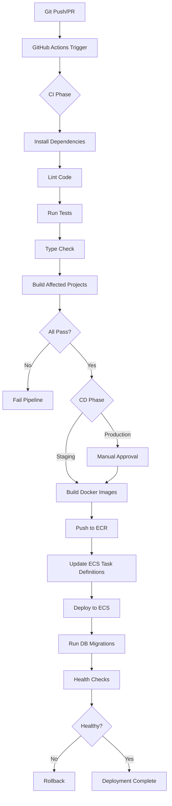

# CI/CD Planning Document - MFE Payments System

**Document Version:** 1.0  
**Date:** December 12, 2025  
**Status:** Planning Phase  
**Project:** MFE Payments System - Production Deployment  
**Repository:** https://github.com/pateatlau/payments-system-mfe-microservices-fullstack-nx-2026

---

## Table of Contents

1. [Executive Summary](#1-executive-summary)
2. [Current State Analysis](#2-current-state-analysis)
3. [CI/CD Tool Selection](#3-cicd-tool-selection)
4. [Deployment Target Selection](#4-deployment-target-selection)
5. [Architecture Design](#5-architecture-design)
6. [Implementation Strategy](#6-implementation-strategy)
7. [Requirements & Prerequisites](#7-requirements--prerequisites)
8. [Cost Analysis](#8-cost-analysis)
9. [Risk Assessment](#9-risk-assessment)
10. [Success Criteria](#10-success-criteria)
11. [Timeline & Phases](#11-timeline--phases)
12. [Next Steps](#12-next-steps)

---

## 1. Executive Summary

### Objective

Implement a production-ready CI/CD pipeline to enable automated testing, building, and deployment of the MFE Payments System to a cloud environment accessible on the internet.

### Key Decisions

- **CI/CD Tool:** GitHub Actions (native integration, free tier, Nx support)
- **Deployment Target:** AWS ECS (Fargate) - managed containers, Docker Compose compatibility
- **Infrastructure as Code:** AWS CDK (TypeScript) - aligns with project stack
- **Environments:** Staging (auto-deploy) + Production (manual approval)

### Benefits

- Automated testing and quality gates
- Consistent, repeatable deployments
- Zero-downtime deployments (blue/green)
- Independent service scaling
- Production-ready infrastructure
- Internet-accessible live demo

---

## 2. Current State Analysis

### Project Structure

**Frontend (4 Applications):**

- Shell app (host, port 4200)
- Auth MFE (remote, port 4201)
- Payments MFE (remote, port 4202)
- Admin MFE (remote, port 4203)

**Backend (5 Services):**

- API Gateway (port 3000)
- Auth Service (port 3001)
- Payments Service (port 3002)
- Admin Service (port 3003)
- Profile Service (port 3004)

**Infrastructure (Docker Compose):**

- nginx reverse proxy (ports 80, 443)
- 4 PostgreSQL databases (separate per service)
- RabbitMQ event hub
- Redis cache
- Prometheus, Grafana, Jaeger (observability)

### Current Deployment

- **Local Development:** Docker Compose + manual service starts
- **Build Process:** Nx monorepo with affected builds
- **Testing:** Jest + React Testing Library + Playwright
- **No CI/CD:** Manual testing and deployment
- **No Cloud Deployment:** Local-only access

### Challenges to Address

1. **Monorepo Complexity:** 9 applications + shared libraries
2. **Module Federation:** Remote entry files must be built in correct order
3. **Multiple Databases:** 4 separate PostgreSQL instances
4. **Service Dependencies:** Services depend on infrastructure (RabbitMQ, Redis, DBs)
5. **Environment Configuration:** Complex env var management across services
6. **Database Migrations:** Prisma migrations need to run before services start

---

## 3. CI/CD Tool Selection

### Decision: GitHub Actions

**Rationale:**

1. **Native Integration**
   - Repository hosted on GitHub
   - No additional service setup required
   - Built-in secrets management
   - Free for public repositories

2. **Nx Monorepo Support**
   - Excellent Nx caching support
   - `nx affected` command integration
   - Parallel execution for independent projects
   - Build artifact caching

3. **Docker Support**
   - Native Docker build and push
   - ECR integration via AWS CLI
   - Multi-stage build support
   - Layer caching

4. **Flexibility**
   - Matrix builds for multiple Node.js versions
   - Conditional workflows
   - Manual approval gates
   - Custom actions and scripts

5. **Cost**
   - Free for public repos
   - 2,000 minutes/month free for private repos
   - Additional minutes: $0.008/minute

### Alternative Tools Considered

| Tool             | Pros                           | Cons                                 | Decision     |
| ---------------- | ------------------------------ | ------------------------------------ | ------------ |
| **GitLab CI/CD** | Self-hosted option, integrated | Would require migration              | Not selected |
| **CircleCI**     | Excellent Nx support           | Additional cost, complexity          | Not selected |
| **Jenkins**      | Self-hosted, flexible          | Requires infrastructure, maintenance | Not selected |
| **Azure DevOps** | Good integration               | Microsoft ecosystem lock-in          | Not selected |

---

## 4. Deployment Target Selection

### Decision: AWS ECS (Fargate)

**Rationale:**

1. **Docker Compose Compatibility**
   - Easy migration from local Docker Compose setup
   - Same container images work locally and in cloud
   - Minimal code changes required

2. **Managed Service**
   - No EC2 instance management
   - Automatic scaling
   - Pay-per-use pricing
   - Built-in load balancing

3. **Multi-Service Support**
   - Separate ECS tasks for each service
   - Independent scaling per service
   - Service discovery built-in
   - Health checks and auto-restart

4. **Cost-Effective**
   - No idle server costs
   - Pay only for running containers
   - Free tier available (limited)
   - Predictable pricing

5. **Production-Ready Features**
   - Blue/Green deployments
   - Rolling updates
   - Integration with ALB (Application Load Balancer)
   - CloudWatch integration

### Architecture Overview

```
┌─────────────────────────────────────────────────────────┐
│                    Internet Users                       │
└────────────────────┬────────────────────────────────────┘
                     │
                     v
┌─────────────────────────────────────────────────────────┐
│         Application Load Balancer (ALB)                 │
│         - SSL/TLS Termination                           │
│         - Health Checks                                 │
│         - Routing Rules                                 │
└───────────────────────┬─────────────────────────────────┘
                        │
        ┌───────────────┼─────────────────┐
        │               │                 │
        v               v                 v
┌──────────────┐ ┌──────────────┐ ┌──────────────┐
│  ECS Cluster │ │  ECS Cluster │ │  ECS Cluster │
│  (Staging)   │ │ (Production) │ │  (Migration) │
└──────────────┘ └──────────────┘ └──────────────┘
        │               │                 │
        └───────────────┼─────────────────┘
                        │
        ┌───────────────┼─────────────────┐
        │               │                 │
        v               v                 v
┌──────────────┐ ┌──────────────┐ ┌──────────────┐
│     RDS      │ │ ElastiCache  │ │  Amazon MQ   │
│  PostgreSQL  │ │    Redis     │ │   RabbitMQ   │
│  (4 DBs)     │ │              │ │              │
└──────────────┘ └──────────────┘ └──────────────┘
```

### Alternative Deployment Targets Considered

| Target                        | Pros                             | Cons                                      | Decision             |
| ----------------------------- | -------------------------------- | ----------------------------------------- | -------------------- |
| **EKS (Kubernetes)**          | Industry standard, very scalable | Complex setup, overkill for current scale | Future consideration |
| **EC2 + Docker Compose**      | Simple, familiar                 | Manual scaling, server management         | Not selected         |
| **Lambda/Serverless**         | Auto-scaling, pay-per-request    | Cold starts, 15min timeout, complex       | Not suitable         |
| **App Runner**                | Simple, managed                  | Limited customization                     | Not selected         |
| **DigitalOcean App Platform** | Simple, cost-effective           | Less AWS integration                      | Not selected         |

---

## 5. Architecture Design

### CI/CD Pipeline Flow



### Service Deployment Strategy

**Frontend Services (Static Assets):**

- Build with Rspack/Nx
- Serve via nginx container
- CDN-ready (CloudFront future enhancement)

**Backend Services (Node.js):**

- Multi-stage Docker builds
- Runtime: Node.js 24.11.x LTS
- Health check endpoints required
- Graceful shutdown handling

**Infrastructure Services:**

- nginx: Containerized reverse proxy
- Databases: AWS RDS (managed PostgreSQL)
- Cache: ElastiCache Redis
- Message Broker: Amazon MQ (RabbitMQ) or ElastiCache

### Environment Strategy

**Staging Environment:**

- Auto-deploy on `develop` branch
- Smaller instance sizes
- Test data
- Full observability stack

**Production Environment:**

- Manual approval required
- Larger instance sizes
- Production data
- Enhanced monitoring and alerting

### Database Migration Strategy

1. **Pre-Deployment:**
   - Backup current database state
   - Validate migration scripts
   - Test migrations on staging

2. **During Deployment:**
   - Run migrations as ECS one-time task
   - Wait for completion before starting services
   - Rollback on failure

3. **Post-Deployment:**
   - Verify migration success
   - Health check all services
   - Monitor for errors

---

## 6. Implementation Strategy

### Phase 1: CI Pipeline Setup

**Objective:** Automated testing and quality gates

**Tasks:**

- Create `.github/workflows/ci.yml`
- Configure Nx affected builds
- Set up test execution (parallel)
- Configure linting and type checking
- Set up artifact caching
- Configure matrix builds (Node.js versions)

**Success Criteria:**

- CI runs on every push/PR
- All tests pass before merge
- Build artifacts cached
- Fast feedback (< 10 minutes)

### Phase 2: Docker Configuration

**Objective:** Containerize all services

**Tasks:**

- Create Dockerfiles for all 9 services + nginx
- Multi-stage builds for optimization
- Configure `.dockerignore`
- Test builds locally
- Optimize image sizes

**Success Criteria:**

- All Docker images build successfully
- Images < 500MB each
- Build time < 5 minutes per service

### Phase 3: AWS Infrastructure Setup

**Objective:** Production-ready cloud infrastructure

**Tasks:**

- Set up AWS CDK project (TypeScript)
- Create VPC with public/private subnets
- Create ECR repositories (one per service)
- Create ECS clusters (staging + production)
- Set up RDS PostgreSQL instances (4 databases)
- Configure ElastiCache Redis
- Set up Application Load Balancer
- Configure security groups and IAM roles
- Set up AWS Secrets Manager

**Success Criteria:**

- All infrastructure provisioned
- Services can communicate
- Security groups configured correctly
- Secrets stored securely

### Phase 4: CD Pipeline Setup

**Objective:** Automated deployment to staging

**Tasks:**

- Create `.github/workflows/cd-staging.yml`
- Build and push Docker images to ECR
- Create ECS task definitions
- Deploy to staging ECS cluster
- Configure health checks
- Set up rollback mechanism

**Success Criteria:**

- Staging deployment automated
- Health checks pass
- Services accessible
- Rollback works

### Phase 5: Production Deployment

**Objective:** Production deployment with safety gates

**Tasks:**

- Create `.github/workflows/cd-production.yml`
- Add manual approval gate
- Deploy to production ECS cluster
- Enhanced health checks
- Monitoring and alerting
- Database migration automation

**Success Criteria:**

- Production deployment with approval
- Zero-downtime deployments
- Health checks pass
- Monitoring active

### Phase 6: Database Migration Automation

**Objective:** Automated, safe database migrations

**Tasks:**

- Create migration ECS task definition
- Pre-deployment backup script
- Migration execution script
- Rollback script
- Integration with CD pipeline

**Success Criteria:**

- Migrations run automatically
- Backups created before migrations
- Rollback works on failure
- Zero data loss

### Phase 7: Monitoring & Observability

**Objective:** Full visibility into production

**Tasks:**

- CloudWatch Logs integration
- CloudWatch Metrics setup
- Custom dashboards
- Alerting rules
- Integration with existing Sentry

**Success Criteria:**

- All logs in CloudWatch
- Metrics collected
- Dashboards functional
- Alerts configured

### Phase 8: Security Hardening

**Objective:** Production-grade security

**Tasks:**

- SSL/TLS certificates (AWS Certificate Manager)
- Security scanning in CI
- Secrets rotation strategy
- IAM least privilege
- Network security hardening

**Success Criteria:**

- HTTPS enforced
- Security scans pass
- Secrets managed securely
- Network isolated

---

## 7. Requirements & Prerequisites

### GitHub Requirements

**Secrets to Configure:**

- `AWS_ACCESS_KEY_ID` - AWS access key
- `AWS_SECRET_ACCESS_KEY` - AWS secret key
- `AWS_REGION` - AWS region (e.g., `us-east-1`)
- `ECR_REPOSITORY_SHELL` - ECR repository for shell app
- `ECR_REPOSITORY_AUTH_MFE` - ECR repository for auth MFE
- `ECR_REPOSITORY_PAYMENTS_MFE` - ECR repository for payments MFE
- `ECR_REPOSITORY_ADMIN_MFE` - ECR repository for admin MFE
- `ECR_REPOSITORY_API_GATEWAY` - ECR repository for API Gateway
- `ECR_REPOSITORY_AUTH_SERVICE` - ECR repository for auth service
- `ECR_REPOSITORY_PAYMENTS_SERVICE` - ECR repository for payments service
- `ECR_REPOSITORY_ADMIN_SERVICE` - ECR repository for admin service
- `ECR_REPOSITORY_PROFILE_SERVICE` - ECR repository for profile service
- `ECR_REPOSITORY_NGINX` - ECR repository for nginx
- `ECS_CLUSTER_STAGING` - Staging ECS cluster name
- `ECS_CLUSTER_PRODUCTION` - Production ECS cluster name

### AWS Requirements

**Account Setup:**

- AWS account with billing enabled
- IAM user with appropriate permissions
- AWS CLI configured locally (for testing)

**Required AWS Services:**

- ECR (Elastic Container Registry)
- ECS (Elastic Container Service)
- Fargate (container runtime)
- RDS (Relational Database Service)
- ElastiCache (Redis)
- Amazon MQ (RabbitMQ) or ElastiCache alternative
- Application Load Balancer (ALB)
- VPC (Virtual Private Cloud)
- Security Groups
- IAM (Identity and Access Management)
- Secrets Manager
- Certificate Manager (ACM)
- CloudWatch (Logs and Metrics)

**Permissions Required:**

- ECR: Push/pull images
- ECS: Create/update services, task definitions
- RDS: Create/manage databases
- ElastiCache: Create/manage cache clusters
- ALB: Create/manage load balancers
- VPC: Create/manage networking
- IAM: Create roles and policies
- Secrets Manager: Store/retrieve secrets
- CloudWatch: Write logs and metrics

### Local Development Requirements

**Tools:**

- Docker Desktop (for local testing)
- AWS CLI v2
- Node.js 24.11.x LTS
- pnpm 9.x
- Git

**Knowledge:**

- Docker and containerization
- AWS services (ECS, RDS, etc.)
- GitHub Actions workflows
- Nx monorepo concepts
- CI/CD best practices

---

## 8. Cost Analysis

### AWS Service Costs (Monthly Estimates)

**ECS Fargate (Container Runtime):**

- Staging: 9 services × 0.25 vCPU × 0.5 GB × $0.04/vCPU-hour × 730 hours = **$32.85/month**
- Production: 9 services × 0.5 vCPU × 1 GB × $0.04/vCPU-hour × 730 hours = **$131.40/month**
- **Total ECS: ~$164/month**

**RDS PostgreSQL (4 Databases):**

- Staging: 4 × db.t3.micro × $0.017/hour × 730 hours = **$49.64/month**
- Production: 4 × db.t3.small × $0.034/hour × 730 hours = **$99.28/month**
- **Total RDS: ~$149/month**

**ElastiCache Redis:**

- Staging: cache.t3.micro × $0.017/hour × 730 hours = **$12.41/month**
- Production: cache.t3.small × $0.034/hour × 730 hours = **$24.82/month**
- **Total ElastiCache: ~$37/month**

**Application Load Balancer:**

- $0.0225/hour × 730 hours = **$16.43/month**
- LCU charges: ~$10/month (estimated)
- **Total ALB: ~$26/month**

**ECR (Container Registry):**

- Storage: 10 images × 500MB × $0.10/GB = **$0.50/month**
- Data transfer: Minimal (internal AWS)
- **Total ECR: ~$1/month**

**Data Transfer:**

- Outbound data: ~100GB/month × $0.09/GB = **$9/month**
- **Total Data Transfer: ~$9/month**

**CloudWatch:**

- Logs: ~50GB/month × $0.50/GB = **$25/month**
- Metrics: Included (free tier)
- **Total CloudWatch: ~$25/month**

**Amazon MQ (RabbitMQ Alternative):**

- mq.t3.micro × $0.05/hour × 730 hours = **$36.50/month**
- **Or use ElastiCache Pub/Sub: Included in ElastiCache cost**

**VPC, Security Groups, IAM:**

- **Free (no additional cost)**

### Total Monthly Cost Estimate

| Environment    | Estimated Cost  |
| -------------- | --------------- |
| **Staging**    | ~$120/month     |
| **Production** | ~$300/month     |
| **Total**      | **~$420/month** |

### Cost Optimization Strategies

1. **Right-Sizing:**
   - Start with smaller instances
   - Monitor and scale up as needed
   - Use auto-scaling for variable load

2. **Reserved Instances:**
   - Consider RDS Reserved Instances (1-year term)
   - 30-40% savings on database costs

3. **Spot Instances:**
   - Not suitable for ECS Fargate (always on-demand)
   - Consider for batch jobs if needed

4. **S3 + CloudFront:**
   - Move static assets to S3 + CloudFront
   - Reduce ECS compute for static serving

5. **Monitoring:**
   - Set up billing alerts
   - Review costs monthly
   - Optimize based on actual usage

### Free Tier Considerations

- **ECR:** 500MB storage free for 12 months
- **CloudWatch:** 5GB logs, 10 metrics free
- **Data Transfer:** 1GB outbound free per month
- **RDS:** db.t2.micro free for 12 months (750 hours)

**First Year Savings:** ~$50-100/month with free tier

---

## 9. Risk Assessment

### Technical Risks

| Risk                            | Impact | Probability | Mitigation                                |
| ------------------------------- | ------ | ----------- | ----------------------------------------- |
| **Docker build failures**       | High   | Medium      | Test builds locally, optimize Dockerfiles |
| **Database migration failures** | High   | Low         | Backup before migrations, test on staging |
| **Service dependency issues**   | Medium | Medium      | Health checks, dependency ordering        |
| **Module Federation issues**    | Medium | Low         | Build verification, remote entry checks   |
| **ECS deployment failures**     | High   | Low         | Blue/green deployment, rollback mechanism |
| **Cost overruns**               | Medium | Medium      | Billing alerts, cost monitoring           |
| **Security vulnerabilities**    | High   | Low         | Security scanning, secrets management     |
| **Performance issues**          | Medium | Medium      | Load testing, monitoring, auto-scaling    |

### Operational Risks

| Risk                     | Impact | Probability | Mitigation                           |
| ------------------------ | ------ | ----------- | ------------------------------------ |
| **AWS service outages**  | High   | Low         | Multi-AZ deployment, health checks   |
| **Data loss**            | High   | Very Low    | Automated backups, RDS snapshots     |
| **Deployment downtime**  | Medium | Low         | Blue/green deployment, health checks |
| **Configuration errors** | Medium | Medium      | Infrastructure as Code, testing      |
| **Secret exposure**      | High   | Low         | AWS Secrets Manager, least privilege |

### Business Risks

| Risk              | Impact | Probability | Mitigation                       |
| ----------------- | ------ | ----------- | -------------------------------- |
| **Cost overruns** | Medium | Medium      | Budget alerts, cost optimization |
| **Time overruns** | Low    | Medium      | Phased approach, MVP first       |
| **Skill gaps**    | Medium | Low         | Documentation, training          |

---

## 10. Success Criteria

### CI Pipeline Success

- [ ] CI runs automatically on every push to `main`, `develop`, and PRs
- [ ] All unit tests pass (70%+ coverage maintained)
- [ ] Linting passes with zero errors
- [ ] Type checking passes with zero errors
- [ ] Build succeeds for all affected projects
- [ ] CI completes in < 10 minutes for typical changes
- [ ] Artifact caching reduces build time by 50%+

### Docker Build Success

- [ ] All 10 Docker images build successfully
- [ ] Images are < 500MB each
- [ ] Build time < 5 minutes per service
- [ ] Images pushed to ECR successfully
- [ ] Images are tagged with git commit SHA

### Staging Deployment Success

- [ ] Automated deployment on push to `develop` branch
- [ ] All services deploy successfully
- [ ] Health checks pass for all services
- [ ] Database migrations run automatically
- [ ] Services accessible via staging URL
- [ ] Rollback works on failure
- [ ] Deployment completes in < 15 minutes

### Production Deployment Success

- [ ] Manual approval gate works
- [ ] Production deployment on push to `main` branch
- [ ] Zero-downtime deployment (blue/green)
- [ ] All services healthy after deployment
- [ ] Database migrations successful
- [ ] Application accessible on internet
- [ ] SSL/TLS certificates configured
- [ ] Monitoring and logging active

### Infrastructure Success

- [ ] All AWS resources provisioned
- [ ] Services can communicate
- [ ] Security groups configured correctly
- [ ] Secrets stored in Secrets Manager
- [ ] Load balancer routes traffic correctly
- [ ] Databases accessible from services
- [ ] Redis cache working
- [ ] RabbitMQ/event hub working

### Monitoring Success

- [ ] CloudWatch Logs collecting all service logs
- [ ] CloudWatch Metrics showing service health
- [ ] Custom dashboards functional
- [ ] Alerts configured for critical issues
- [ ] Sentry error tracking working
- [ ] Health check endpoints responding

### Security Success

- [ ] HTTPS enforced (no HTTP access)
- [ ] Security scanning passes in CI
- [ ] Secrets not exposed in logs
- [ ] IAM roles follow least privilege
- [ ] Network security groups configured
- [ ] SSL/TLS certificates valid

---

## 11. Timeline & Phases

### Estimated Timeline

**Total Duration:** 4-6 weeks (assuming part-time work)

| Phase                              | Duration  | Dependencies |
| ---------------------------------- | --------- | ------------ |
| **Phase 1: CI Pipeline**           | 3-5 days  | None         |
| **Phase 2: Docker Configuration**  | 5-7 days  | Phase 1      |
| **Phase 3: AWS Infrastructure**    | 7-10 days | Phase 2      |
| **Phase 4: CD Pipeline (Staging)** | 5-7 days  | Phase 3      |
| **Phase 5: Production Deployment** | 3-5 days  | Phase 4      |
| **Phase 6: Database Migrations**   | 3-5 days  | Phase 5      |
| **Phase 7: Monitoring**            | 3-5 days  | Phase 5      |
| **Phase 8: Security Hardening**    | 3-5 days  | Phase 5      |

### Phase Dependencies

```
Phase 1 (CI)
    ↓
Phase 2 (Docker)
    ↓
Phase 3 (AWS Infrastructure)
    ↓
Phase 4 (CD Staging) ──┐
    ↓                   │
Phase 5 (Production) ←───┘
    ↓
Phase 6 (DB Migrations)
    ↓
Phase 7 (Monitoring)
    ↓
Phase 8 (Security)
```

### Critical Path

1. CI Pipeline (enables quality gates)
2. Docker Configuration (enables containerization)
3. AWS Infrastructure (enables deployment)
4. CD Pipeline (enables automation)
5. Production Deployment (enables live demo)

---

## 12. Next Steps

### Immediate Actions

1. **Review and Approve Plan**
   - Review this planning document
   - Confirm tool selections (GitHub Actions + AWS ECS)
   - Approve cost estimates
   - Confirm timeline

2. **Set Up AWS Account**
   - Create AWS account (if not exists)
   - Set up billing alerts
   - Create IAM user for CI/CD
   - Configure AWS CLI locally

3. **Set Up GitHub Secrets**
   - Add AWS credentials to GitHub Secrets
   - Add ECR repository names
   - Add ECS cluster names
   - Test secret access

4. **Begin Phase 1 Implementation**
   - Create `.github/workflows/ci.yml`
   - Configure Nx affected builds
   - Test CI pipeline locally
   - Verify all tests pass

### Implementation Order

1. Start with **Phase 1: CI Pipeline** (foundation)
2. Proceed to **Phase 2: Docker Configuration** (containerization)
3. Then **Phase 3: AWS Infrastructure** (cloud setup)
4. Follow with **Phase 4: CD Pipeline** (automation)
5. Complete with remaining phases

### Documentation Updates

After implementation, update:

- `README.md` - Add deployment instructions
- `docs/EXECUTIVE_SUMMARY.md` - Update status
- `docs/CONTINUATION_PROMPT.md` - Add deployment info
- Create deployment runbook

---

## Appendix A: Tool Comparison Matrix

### CI/CD Tools

| Feature             | GitHub Actions | GitLab CI | CircleCI       | Jenkins            |
| ------------------- | -------------- | --------- | -------------- | ------------------ |
| **Cost (Public)**   | Free           | Free      | Free (limited) | Free (self-hosted) |
| **Cost (Private)**  | $0.008/min     | Free      | $0.006/min     | Free (self-hosted) |
| **Nx Support**      | Excellent      | Good      | Excellent      | Good               |
| **Docker Support**  | Native         | Native    | Native         | Plugin             |
| **AWS Integration** | Excellent      | Good      | Good           | Good               |
| **Ease of Setup**   | Very Easy      | Easy      | Easy           | Complex            |
| **Learning Curve**  | Low            | Low       | Medium         | High               |

### Deployment Targets

| Feature            | ECS Fargate   | EKS           | EC2 + Docker  | Lambda       |
| ------------------ | ------------- | ------------- | ------------- | ------------ |
| **Management**     | Fully Managed | Managed K8s   | Self-Managed  | Serverless   |
| **Scaling**        | Auto          | Auto          | Manual        | Auto         |
| **Cost (Small)**   | $50-100/mo    | $100-200/mo   | $20-50/mo     | Pay-per-use  |
| **Docker Support** | Native        | Native        | Native        | Limited      |
| **Learning Curve** | Low           | High          | Medium        | Medium       |
| **Best For**       | Containers    | K8s workloads | Simple setups | Event-driven |

---

## Appendix B: Reference Implementation Plan

A detailed implementation plan with specific file structures, code examples, and step-by-step instructions is available at:

**Location:** `/Users/patea/.cursor/plans/ci_cd_implementation_plan_3a5982ab.plan.md`

This implementation plan includes:

- Detailed file structures
- Code examples for workflows
- Dockerfile templates
- AWS CDK code structure
- Deployment scripts
- Task definitions

---

## Document History

| Version | Date       | Author       | Changes                   |
| ------- | ---------- | ------------ | ------------------------- |
| 1.0     | 2025-12-12 | AI Assistant | Initial planning document |

---

**End of Document**
