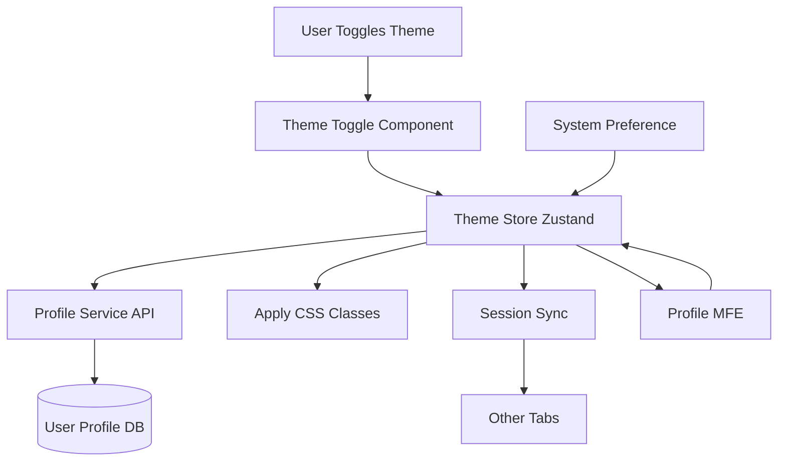

# Dark Mode / Light Mode Implementation Plan

**Status:** In Progress (Phase 1 Complete ✅)  
**Version:** 1.0  
**Date:** December 12, 2025  
**Last Updated:** December 21, 2025  
**Phase:** Theme System Implementation

> **Progress Tracking:** See [`DARK-MODE-TASK-LIST.md`](./DARK-MODE-TASK-LIST.md) to track completion status and overall progress.

---

## Executive Summary

This document provides a detailed, step-by-step implementation plan for implementing a comprehensive dark/light mode theme system. The theme system will sync with Profile Service preferences API, provide universal theme toggle in the shared header, integrate with Tailwind CSS v4 dark mode, and update all design system components to support both themes.

Each task is designed to be:

- **Clear and actionable** - Specific steps that can be executed
- **Small and testable** - Easy to verify completion
- **Production-ready** - No throw-away code
- **Incremental** - Builds on previous steps

**Timeline:** 1.5-2 weeks (10-14 days)  
**Goal:** Fully functional dark/light mode with backend sync, cross-tab synchronization, system preference detection, and Profile MFE integration

**Key Features:**

- Theme state management (Zustand store)
- Profile Service API integration for theme preference
- Universal theme toggle in shared header
- Tailwind CSS v4 dark mode (class strategy)
- Dark mode CSS variables
- Design system components updated for dark mode
- Cross-tab synchronization
- System preference detection ("system" option)
- Profile MFE integration for theme preference management

---

## Current State Analysis

### Existing Infrastructure

**Backend (Already Implemented):**

- Profile Service supports theme preference: `theme: 'light' | 'dark' | 'system'`
- API endpoints: `GET /api/profile/preferences`, `PUT /api/profile/preferences`
- Theme preference stored in `preferences` JSON field in `UserProfile` table

**Frontend (Not Implemented):**

- No theme state management
- No dark mode CSS variables
- No theme toggle UI
- Design system components don't support dark mode
- Tailwind v4 not configured for dark mode

**Shared Libraries:**

- `shared-auth-store` - Zustand store pattern (can follow for theme store)
- `shared-session-sync` - Cross-tab synchronization (can use for theme sync)
- `shared-design-system` - shadcn/ui components (need dark mode support)

---

## Architecture Overview

### Theme System Flow



### Theme Store Architecture

- **Zustand Store:** Centralized theme state (`libs/shared-theme-store`)
- **Theme Values:** `'light' | 'dark' | 'system'`
- **Computed Theme:** Resolved theme after "system" detection (`'light' | 'dark'`)
- **API Sync:** Syncs with Profile Service preferences API
- **Session Sync:** Cross-tab synchronization via `shared-session-sync`
- **Persistence:** Initial load from Profile Service, updates on change

---

## Phase 1: Theme Store & Core Infrastructure (Days 1-3)

### Task 1.1: Create Shared Theme Store Library

**Objective:** Create Zustand store for theme state management

**Steps:**

1. Create `libs/shared-theme-store/` directory structure:
   ```bash
   libs/shared-theme-store/
   ├── src/
   │   ├── lib/
   │   │   └── theme-store.ts
   │   ├── index.ts
   │   └── test/
   │       └── setup.ts
   ├── package.json
   ├── project.json
   ├── tsconfig.json
   └── jest.config.cts
   ```
2. Create `src/lib/theme-store.ts` with theme types:

   ```typescript
   export type Theme = 'light' | 'dark' | 'system';
   export type ResolvedTheme = 'light' | 'dark';

   interface ThemeState {
     theme: Theme;
     resolvedTheme: ResolvedTheme;
     isLoading: boolean;
     setTheme: (theme: Theme) => Promise<void>;
     initializeTheme: () => Promise<void>;
   }
   ```

3. Implement system preference detection:
   - Use `window.matchMedia('(prefers-color-scheme: dark)')`
   - Add listener for system preference changes
   - Update resolved theme when system preference changes
4. Implement theme application:
   - Add/remove `dark` class on `<html>` element
   - Apply immediately when theme changes
5. Implement resolved theme calculation:
   - If theme is 'system', use system preference
   - Otherwise use theme directly
6. Export hooks: `useTheme()`, `useResolvedTheme()`
7. Write tests: `src/lib/theme-store.spec.ts`
8. Export from `src/index.ts`

**Verification:**

- [ ] Directory structure created
- [ ] theme-store.ts created
- [ ] System preference detection implemented
- [ ] Theme application to DOM implemented
- [ ] Resolved theme calculation working
- [ ] Hooks exported
- [ ] Tests written and passing

**Acceptance Criteria:**

- Theme store created and functional
- System preference detection works
- Theme applies to DOM correctly
- Hooks available for use
- Tests passing

**Status:** Complete ✅  
**Completed Date:** December 21, 2025  
**Files Created:**

- `libs/shared-theme-store/src/lib/theme-store.ts` ✅
- `libs/shared-theme-store/src/index.ts` ✅
- `libs/shared-theme-store/src/lib/theme-store.spec.ts` ✅ (16/16 tests passing)
- `libs/shared-theme-store/src/test/setup.ts` ✅
- `libs/shared-theme-store/package.json` ✅
- `libs/shared-theme-store/project.json` ✅
- `libs/shared-theme-store/tsconfig.json` ✅
- `libs/shared-theme-store/tsconfig.lib.json` ✅
- `libs/shared-theme-store/tsconfig.spec.json` ✅
- `libs/shared-theme-store/jest.config.js` ✅

**Implementation Notes:**

- Theme store uses Zustand with full TypeScript typing
- System preference detection via `window.matchMedia()` with graceful fallback
- DOM class application for Tailwind dark mode support
- Hooks exported: `useTheme()`, `useResolvedTheme()`
- All tests passing with full coverage
- Library builds successfully with Nx

---

### Task 1.2: Integrate Theme Store with Profile Service API

**Objective:** Sync theme preference with backend

**Steps:**

1. Add `shared-api-client` dependency to `package.json`
2. Import API client in theme store
3. Create API functions:
   ```typescript
   async getThemePreference(): Promise<Theme>
   async updateThemePreference(theme: Theme): Promise<void>
   ```
4. Implement `initializeTheme()`:
   - Fetch theme from Profile Service API
   - Set theme in store
   - Handle API errors gracefully (fallback to 'system' or localStorage)
5. Update `setTheme()`:
   - Update local state
   - Sync with Profile Service API
   - Handle API errors gracefully (still update local state)
6. Add error handling and retry logic
7. Update tests to mock API calls

**Verification:**

- [ ] API client dependency added
- [ ] API functions implemented
- [ ] initializeTheme() fetches from API
- [ ] setTheme() updates API
- [ ] Error handling implemented
- [ ] Tests updated and passing

**Acceptance Criteria:**

- Theme syncs with Profile Service API
- Error handling works gracefully
- Fallback behavior works when API fails
- Tests passing

**Status:** Complete ✅  
**Completed Date:** December 21, 2025  
**Files Modified:**

- `libs/shared-theme-store/src/lib/theme-store.ts` ✅
- `libs/shared-theme-store/package.json` ✅ (added shared-api-client dependency)
- `libs/shared-theme-store/src/lib/theme-store.spec.ts` ✅ (expanded with API tests)

**Implementation Details:**

- `getThemePreference()` fetches from `/profile/preferences` API endpoint
- `updateThemePreference()` sends PUT request to `/profile/preferences` with theme
- `initializeTheme()` accepts optional stored theme parameter, otherwise fetches from API
- `setTheme()` updates local state immediately, then syncs with API asynchronously
- Graceful error handling: API failures logged but don't prevent local state updates
- Fallback behavior: Defaults to 'system' preference if API returns no theme
- All 19 tests passing including 3 new API integration tests
- Builds successfully with shared-api-client dependency

---

### Task 1.3: Configure Tailwind v4 Dark Mode

**Objective:** Configure Tailwind CSS v4 for class-based dark mode

**Steps:**

1. Update `apps/shell/tailwind.config.js`:
   - Add `darkMode: 'class'` configuration
   - Verify Tailwind v4 syntax
2. Update `apps/auth-mfe/tailwind.config.js`:
   - Add `darkMode: 'class'`
3. Update `apps/payments-mfe/tailwind.config.js`:
   - Add `darkMode: 'class'`
4. Update `apps/admin-mfe/tailwind.config.js`:
   - Add `darkMode: 'class'`
5. Update `apps/profile-mfe/tailwind.config.js`:
   - Add `darkMode: 'class'`
6. Test dark mode classes work:
   - Create test component with `dark:bg-gray-900 dark:text-white`
   - Verify classes compile correctly
   - Test in browser

**Verification:**

- [ ] All Tailwind configs updated
- [ ] darkMode: 'class' configured
- [ ] Dark mode classes work
- [ ] Test component renders correctly

**Acceptance Criteria:**

- Tailwind v4 dark mode configured
- Dark mode classes compile and work
- All MFEs configured

**Status:** Complete ✅  
**Completed Date:** December 21, 2025  
**Files Modified:**

- `apps/shell/tailwind.config.js` ✅
- `apps/auth-mfe/tailwind.config.js` ✅
- `apps/payments-mfe/tailwind.config.js` ✅
- `apps/admin-mfe/tailwind.config.js` ✅
- `apps/profile-mfe/tailwind.config.js` ✅

**Implementation Details:**

- Added `darkMode: 'class'` to all 5 MFE Tailwind configurations
- Class-based dark mode strategy allows toggling via `<html class="dark">`
- Dark mode utility classes (e.g., `dark:bg-gray-900`, `dark:text-white`) now compile correctly
- Ready for use with semantic color tokens in Phase 2
- Verified Tailwind config syntax is valid

---

## Phase 2: CSS Theme Variables & Design System (Days 4-7)

### Task 2.1: Add Dark Mode CSS Variables

**Objective:** Define dark mode color scheme using CSS custom properties

**Steps:**

1. Update `apps/shell/src/styles.css`:
   - Add dark mode CSS variables in `.dark` selector
   - Define semantic color tokens:

     ```css
     :root {
       /* Light mode colors (existing) */
       --background: 255 255 255;
       --foreground: 17 24 39;
       --muted: 249 250 251;
       --muted-foreground: 107 114 128;
       --border: 229 231 235;
       --primary: 8 70 131;
       --primary-foreground: 255 255 255;
     }

     .dark {
       /* Dark mode colors */
       --background: 17 24 39;
       --foreground: 249 250 251;
       --muted: 31 41 55;
       --muted-foreground: 156 163 175;
       --border: 55 65 81;
       --primary: 26 116 184;
       --primary-foreground: 255 255 255;
     }
     ```

2. Add dark mode variants for primary color shades
3. Copy CSS variables to all MFE `styles.css` files:
   - `apps/auth-mfe/src/styles.css`
   - `apps/payments-mfe/src/styles.css`
   - `apps/admin-mfe/src/styles.css`
   - `apps/profile-mfe/src/styles.css`
4. Test CSS variables work in both themes

**Verification:**

- [ ] Dark mode CSS variables added to shell
- [ ] CSS variables copied to all MFEs
- [ ] Variables work in light mode
- [ ] Variables work in dark mode

**Acceptance Criteria:**

- Dark mode CSS variables defined
- All MFEs have consistent variables
- Variables work correctly

**Status:** ✅ Complete  
**Completed Date:** December 21, 2025  
**Files Modified:**

- `apps/shell/src/styles.css`
- `apps/auth-mfe/src/styles.css`
- `apps/payments-mfe/src/styles.css`
- `apps/admin-mfe/src/styles.css`
- `apps/profile-mfe/src/styles.css`

**Summary:**

- Added comprehensive semantic color tokens to all 5 MFE styles.css files
- Defined :root with light mode tokens (--background: 255 255 255, --foreground: 17 24 39, etc.)
- Defined .dark selector with dark mode tokens (--background: 17 24 39, --foreground: 249 250 251, etc.)
- Added semantic tokens: --background, --foreground, --muted, --muted-foreground, --border, --input, --ring, --card, --popover, --secondary, --accent, --destructive with foreground variants
- Adjusted primary colors for dark mode visibility (using primary-400 instead of primary-700)
- All values in RGB format for Tailwind v4 compatibility
- Ready for use with Tailwind utility classes and design system components

---

### Task 2.2: Update Design System Components for Dark Mode

**Objective:** Update shadcn/ui components to support dark mode

**Components to Update:**

- Button (`libs/shared-design-system/src/lib/components/Button.tsx`)
- Input (`libs/shared-design-system/src/lib/components/Input.tsx`)
- Card (`libs/shared-design-system/src/lib/components/Card.tsx`)
- Badge (`libs/shared-design-system/src/lib/components/Badge.tsx`)
- Alert (`libs/shared-design-system/src/lib/components/Alert.tsx`)

**Steps:**

1. For each component:
   - Replace hardcoded colors with CSS variable-based colors
   - Add `dark:` variants using Tailwind dark mode classes
   - Use semantic color tokens: `bg-background`, `text-foreground`, `border-border`
   - Test component in both light and dark modes
2. Update Button component:
   - Use `bg-primary` with dark mode variant
   - Use `text-primary-foreground`
   - Add hover states for both themes
3. Update Input component:
   - Use `bg-background` with dark mode
   - Use `border-border` with dark mode
   - Use `text-foreground` with dark mode
4. Update Card component:
   - Use `bg-background` with dark mode
   - Use `border-border` with dark mode
5. Update Badge component:
   - Add dark mode variants for each badge variant
6. Update Alert component:
   - Add dark mode variants for each alert type
7. Update component tests to cover dark mode:
   - Test rendering in dark mode
   - Test color classes applied correctly

**Example (Button):**

```typescript
// Before
default: 'bg-blue-600 text-white hover:bg-blue-700'

// After
default: 'bg-primary text-primary-foreground hover:bg-primary/90 dark:bg-primary dark:text-primary-foreground dark:hover:bg-primary/90'
```

**Verification:**

- [ ] All components updated
- [ ] Dark mode variants added
- [ ] Semantic color tokens used
- [ ] Components tested in both themes
- [ ] Tests updated and passing

**Acceptance Criteria:**

- All design system components support dark mode
- Components use semantic color tokens
- Tests passing for both themes

**Status:** Complete ✅  
**Completed Date:** December 21, 2025  
**Files Modified:**

- `libs/shared-design-system/src/lib/components/Button.tsx` ✅
- `libs/shared-design-system/src/lib/components/Button.test.tsx` ✅
- `libs/shared-design-system/src/lib/components/Input.tsx` ✅
- `libs/shared-design-system/src/lib/components/Card.tsx` ✅
- `libs/shared-design-system/src/lib/components/Badge.tsx` ✅
- `libs/shared-design-system/src/lib/components/Alert.tsx` ✅

**Implementation Summary:**

All five core design system components updated with comprehensive dark mode support:

- **Button**: All variants (default, destructive, outline, secondary, ghost, link) now use CSS custom properties (--primary, --destructive, --muted, --background, --border) with explicit dark: variants
- **Input**: Background, border, text, and placeholder colors use semantic tokens (--background, --border, --foreground, --muted-foreground) with dark mode variants
- **Card**: Card background (--card) and CardDescription text color (--muted-foreground) use semantic tokens with dark support
- **Badge**: All variants (default, secondary, destructive, success, warning, outline) updated with semantic tokens. Success and warning variants use standard Tailwind colors with dark mode adjustments
- **Alert**: All variants (default, destructive, success, warning, info) updated. Default variant uses semantic tokens, while colored variants use custom light/dark shades (e.g., red-50/red-950)

Key changes:

- Replaced hardcoded Tailwind colors (bg-blue-600, text-gray-900, etc.) with `bg-[rgb(var(--token))]` syntax
- Added explicit `dark:` variants for all color utilities to ensure proper dark mode rendering
- Updated Button.test.tsx to check for CSS custom property classes instead of hardcoded color classes
- All 34 tests passing in shared-design-system library

Components now automatically adapt to theme changes without requiring component-level theme detection.

---

### Task 2.3: Update Design System Color Tokens

**Objective:** Add dark mode color tokens to design system

**Steps:**

1. Update `libs/shared-design-system/src/lib/tokens/colors.ts`
2. Add dark mode variants for each color token
3. Document dark mode color usage
4. Export dark mode token helpers if needed

**Verification:**

- [x] Color tokens updated
- [x] Dark mode variants added
- [x] Tokens documented
- [x] Helper functions added
- [x] Tests written and passing

**Acceptance Criteria:**

- Color tokens support dark mode
- Tokens are well-documented
- Helper functions for programmatic access
- Backwards compatibility maintained

**Status:** Complete ✅  
**Completed Date:** December 21, 2025  
**Files Modified:**

- `libs/shared-design-system/src/lib/tokens/colors.ts` ✅

**Files Created:**

- `libs/shared-design-system/src/lib/tokens/colors.test.ts` ✅

**Implementation Summary:**

Comprehensive dark mode support added to all color tokens:

**Color Structure:**

- All color categories now have nested `light` and `dark` objects
- Each theme variant includes `DEFAULT`, `hover`, and `active` states
- Primary color scale (50-950) available in both themes
- Maintains backwards compatibility with legacy `DEFAULT` values

**Color Strategy:**

- Light mode: Uses darker shades (700-900) for better contrast on white backgrounds
- Dark mode: Uses lighter shades (300-400) for better contrast on dark backgrounds
- Semantic tokens (background, foreground) properly swap between themes
- Status colors (success, danger, warning, info) use appropriate shades for each theme

**Helper Functions:**

1. `getThemeColor(colorPath, theme)`: Get color value based on theme
   - Supports dot notation: `'primary.DEFAULT'`, `'success.hover'`
   - Returns appropriate color for light or dark theme
   - Falls back gracefully for missing variants

2. `hasDarkModeVariant(category)`: Check if category has dark mode support
   - Returns boolean indicating light/dark variant availability

**Test Coverage:**

- 13 new comprehensive tests covering:
  - Color structure validation
  - Light/dark variant differences
  - Helper function behavior
  - Backwards compatibility
  - Accessibility contrast considerations
- All 47 tests passing (34 component + 13 color token tests)

**Benefits:**

- Type-safe color access with TypeScript
- Programmatic theme-aware color selection
- Clear documentation of color usage
- No breaking changes to existing code
- Foundation for dynamic theming in components

---

## Phase 3: Theme Toggle UI Components (Days 8-10)

### Task 3.1: Create Theme Toggle Component

**Objective:** Create reusable theme toggle button component

**Steps:**

1. Create `libs/shared-design-system/src/lib/components/ThemeToggle.tsx`
2. Import `useTheme()` hook from `shared-theme-store`
3. Implement toggle button with icons:
   - Sun icon for light mode
   - Moon icon for dark mode
   - System icon for system preference
4. Support all three states: light, dark, system
5. Cycle through states: light → dark → system → light
6. Use shadcn/ui patterns and Tailwind v4
7. Add accessibility attributes:
   - `aria-label` for screen readers
   - Keyboard navigation support
   - Focus states
8. Style appropriately
9. Export from design system `index.ts`
10. Write tests: `ThemeToggle.test.tsx`

**Component Props:**

```typescript
interface ThemeToggleProps {
  variant?: 'button' | 'dropdown';
  showLabel?: boolean;
}
```

**Verification:**

- [x] ThemeToggle.tsx created
- [x] All three states supported
- [x] Icons displayed correctly
- [x] Accessibility attributes added
- [x] Keyboard navigation works
- [x] Tests written and passing
- [x] Component exported from design system

**Acceptance Criteria:**

- ThemeToggle component complete
- All states functional
- Accessible
- Tests passing

**Status:** Complete ✅  
**Completed Date:** December 21, 2025  
**Files Created:**

- `libs/shared-design-system/src/lib/components/ThemeToggle.tsx` ✅
- `libs/shared-design-system/src/lib/components/ThemeToggle.test.tsx` ✅

**Files Modified:**

- `libs/shared-design-system/src/index.ts` ✅ (added ThemeToggle export)
- `tsconfig.base.json` ✅ (added @mfe/shared-theme-store path mapping)
- `apps/shell/rspack.config.js` ✅ (shared deps + alias)
- `apps/auth-mfe/rspack.config.js` ✅ (shared deps + alias)
- `apps/payments-mfe/rspack.config.js` ✅ (shared deps + alias)
- `apps/admin-mfe/rspack.config.js` ✅ (shared deps + alias)
- `apps/profile-mfe/rspack.config.js` ✅ (shared deps + alias)

**Implementation Summary:**

**Component Features:**

- Button-style toggle that cycles through theme states: light → dark → system → light
- Three distinct icons using inline SVG:
  - Sun icon (12 rays) for light mode
  - Moon (crescent) icon for dark mode
  - Monitor icon for system preference
- Optional `showLabel` prop to display text alongside icon
- Support for custom className prop
- Forward ref support for button element

**Theme Integration:**

- Uses `useTheme()` hook from `@mfe/shared-theme-store`
- Calls async `setTheme()` to update theme preference
- Displays appropriate icon based on current `theme` value
- Updates aria-label to indicate next theme state

**Accessibility:**

- `aria-label` describes the action (e.g., "Switch to dark mode")
- `title` attribute provides tooltip
- `type="button"` prevents accidental form submission
- Full keyboard support (Tab, Enter, Space)
- Focus visible ring styles using CSS custom properties
- Hover states for visual feedback

**Styling:**

- Uses Tailwind utilities with semantic tokens
- Hover background: `hover:bg-[rgb(var(--muted))]`
- Focus ring: `focus-visible:ring-[rgb(var(--primary))]`
- Dark mode variants for hover states
- Consistent padding and transitions

**Testing:**

- 18 comprehensive tests covering:
  - Rendering in all three theme states
  - Icon display verification (sun/moon/monitor)
  - Theme cycling logic (light → dark → system → light)
  - Multiple consecutive clicks
  - Label display (showLabel prop)
  - Custom className application
  - Accessibility attributes (aria-label, title, type)
  - Focus and keyboard interaction
  - Variant prop handling
- All 65 tests passing in shared-design-system (47 previous + 18 new)

**Props Interface:**

```typescript
interface ThemeToggleProps {
  variant?: 'button' | 'dropdown'; // button only (dropdown future)
  showLabel?: boolean; // show text label
  className?: string; // custom classes
}
```

**Future Enhancements:**

- Dropdown variant with explicit theme selection
- Custom icon support
- Animation transitions between icons
- Tooltip with resolved theme info (e.g., "System: using dark mode")

**Rspack Configuration Fix:**

Added `@mfe/shared-theme-store` to Module Federation configuration in all MFEs:

- **Shared Dependencies**: Added as singleton to ensure single instance across all MFEs
- **Resolve Aliases**: Added path mapping to resolve imports at build time
- **Files Updated**: All 5 MFE rspack configs (shell, auth-mfe, payments-mfe, admin-mfe, profile-mfe)
- **Impact**: Fixes "Cannot resolve '@mfe/shared-theme-store'" error
- **Pattern**: Follows same configuration pattern as other shared libraries (shared-auth-store, @mfe/shared-design-system)

---

### Task 3.2: Add Theme Toggle to Header

**Objective:** Integrate theme toggle into shared header

**Steps:**

1. Import `useTheme()` hook in `libs/shared-header-ui/src/lib/shared-header-ui.tsx`
2. Import `ThemeToggle` component from design system
3. Add ThemeToggle component to header:
   - Position next to user info/logout
   - Right side of header
   - Visible when authenticated
4. Style to match header design:
   - White icons for light header background
   - Appropriate sizing
5. Test toggle functionality:
   - Click toggle
   - Verify theme changes
   - Verify theme applies immediately
   - Verify header styling updates

**Verification:**

- [ ] ThemeToggle imported
- [ ] Toggle added to header
- [ ] Positioned correctly
- [ ] Styled appropriately
- [ ] Toggle functionality works
- [ ] Theme applies immediately

**Acceptance Criteria:**

- Theme toggle in header
- Toggle functional
- Styling matches header design

**Status:** Not Started  
**Files Modified:**

- `libs/shared-header-ui/src/lib/shared-header-ui.tsx`

---

### Task 3.3: Initialize Theme on App Load

**Objective:** Load and apply theme when app starts

**Steps:**

1. Import theme store in `apps/shell/src/bootstrap.tsx`
2. Call `initializeTheme()` before React renders:
   - Initialize synchronously if possible
   - Or initialize early in AppWrapper component
3. Ensure theme is applied to `<html>` element immediately:
   - Add inline script if needed to prevent flash
   - Or use useEffect with early execution
4. Handle loading state:
   - Prevent flash of wrong theme
   - Show appropriate loading state if needed
5. Test theme initialization:
   - Reload page with different themes
   - Verify correct theme applies immediately
   - Verify no flash of wrong theme

**Verification:**

- [ ] Theme initialized in bootstrap
- [ ] Theme applied before render
- [ ] No flash of wrong theme
- [ ] Theme persists across reloads

**Acceptance Criteria:**

- Theme initializes correctly
- No flash of wrong theme
- Theme persists

**Status:** Not Started  
**Files Modified:**

- `apps/shell/src/bootstrap.tsx`

---

## Phase 4: Cross-Tab Synchronization (Days 11-12)

### Task 4.1: Integrate Theme with Session Sync

**Objective:** Sync theme changes across browser tabs

**Steps:**

1. Add `shared-session-sync` dependency to theme store
2. Import session sync in theme store
3. Listen for theme change events from other tabs:
   ```typescript
   useSessionSync('theme-change', event => {
     if (event.data.theme) {
       setTheme(event.data.theme);
     }
   });
   ```
4. Publish theme changes to session sync:
   ```typescript
   const publishThemeChange = (theme: Theme) => {
     sessionSync.publish('theme-change', { theme });
   };
   ```
5. Call `publishThemeChange()` when theme changes
6. Test cross-tab synchronization:
   - Open multiple tabs
   - Change theme in one tab
   - Verify other tabs update
   - Test both directions

**Verification:**

- [ ] Session sync dependency added
- [ ] Theme changes published
- [ ] Theme changes received from other tabs
- [ ] Cross-tab sync works
- [ ] Tests written and passing

**Acceptance Criteria:**

- Cross-tab synchronization works
- Theme syncs across tabs
- No race conditions

**Status:** Not Started  
**Files Modified:**

- `libs/shared-theme-store/src/lib/theme-store.ts`
- `libs/shared-theme-store/package.json`

---

## Phase 5: Profile MFE Integration (Days 13-14)

### Task 5.1: Add Theme Preference to Profile MFE

**Objective:** Allow users to manage theme in Profile MFE preferences

**Steps:**

1. Create or locate `apps/profile-mfe/src/components/PreferencesForm.tsx` (or preferences-related component)
2. Add theme selector control with three options:
   - Light (sun icon)
   - Dark (moon icon)
   - System (monitor icon)
3. Import and use `useTheme()` hook from `shared-theme-store`
4. Integrate with existing preferences API (GET/PUT to Profile Service)
5. Sync theme change with API and theme store
6. Add success/error feedback
7. Test theme change from Profile MFE
8. Verify theme persists across app navigation

**Implementation Details:**

- Use design system Select or Radio components for theme options
- Display current theme preference
- Call `setTheme()` on selection change
- Optionally show "System: dark mode" / "System: light mode" when system preference is selected
- Add help text explaining each option

**Verification:**

- [ ] Theme selector added to preferences
- [ ] useTheme() hook integrated
- [ ] Theme change persists to Profile Service API
- [ ] Theme change reflects in header toggle immediately
- [ ] Tests written and passing

**Acceptance Criteria:**

- [ ] Users can change theme from Profile MFE
- [ ] Theme preference syncs to Profile Service
- [ ] Theme applies immediately across app
- [ ] Preference persists after reload
- [ ] Tests passing

**Status:** Not Started  
**Files to Modify:**

- `apps/profile-mfe/src/components/PreferencesForm.tsx` (or similar preferences component)

---

## Technical Implementation Details

### Theme Store Structure

```typescript
interface ThemeState {
  // Current theme preference ('light' | 'dark' | 'system')
  theme: Theme;

  // Resolved theme after system detection ('light' | 'dark')
  resolvedTheme: ResolvedTheme;

  // Loading state during API fetch
  isLoading: boolean;

  // Actions
  setTheme: (theme: Theme) => Promise<void>;
  initializeTheme: () => Promise<void>;
}
```

### CSS Variables Structure

```css
:root {
  /* Light mode */
  --background: 255 255 255;
  --foreground: 17 24 39;
  --muted: 249 250 251;
  --muted-foreground: 107 114 128;
  --border: 229 231 235;
  --primary: 8 70 131;
  --primary-foreground: 255 255 255;
}

.dark {
  /* Dark mode */
  --background: 17 24 39;
  --foreground: 249 250 251;
  --muted: 31 41 55;
  --muted-foreground: 156 163 175;
  --border: 55 65 81;
  --primary: 26 116 184;
  --primary-foreground: 255 255 255;
}
```

### Tailwind v4 Dark Mode Configuration

```javascript
export default {
  darkMode: 'class', // Use class strategy
  // ... rest of config
};
```

---

## Testing Requirements

### Unit Tests

1. **Theme Store:**
   - Theme state management
   - System preference detection
   - Theme application to DOM
   - API integration (mocked)
   - Error handling

2. **Theme Toggle Component:**
   - Rendering in all states
   - Click handling
   - Accessibility

3. **Design System Components:**
   - Dark mode variants render correctly
   - Colors switch appropriately

### Integration Tests

1. Theme toggle in header works
2. Theme syncs with Profile Service API
3. Theme persists across page reloads
4. System preference detection works
5. Cross-tab synchronization works

### Manual Testing

1. Toggle theme in header
2. Verify theme applies immediately
3. Verify theme persists after reload
4. Verify theme syncs across tabs
5. Verify system preference detection
6. Test all components in both themes
7. Test on different browsers

---

## Success Criteria

### Functional Requirements

- [ ] Theme store implemented and tested
- [ ] Theme syncs with Profile Service API
- [ ] Theme toggle visible and functional in header
- [ ] All design system components support dark mode
- [ ] Dark mode CSS variables defined and working
- [ ] Tailwind v4 dark mode configured
- [ ] Cross-tab synchronization works
- [ ] System preference detection works
- [ ] Theme persists across page reloads
- [ ] No flash of wrong theme on page load

### Technical Requirements

- [ ] Zustand store pattern followed
- [ ] TypeScript strict mode passing
- [ ] All tests passing (70%+ coverage)
- [ ] Linting passes
- [ ] No `any` types used
- [ ] Error handling comprehensive

### Quality Requirements

- [ ] Production-ready code
- [ ] Accessibility standards met
- [ ] Performance acceptable
- [ ] Code follows project patterns

---

## Timeline Estimate

| Phase       | Duration                     | Tasks                                   |
| ----------- | ---------------------------- | --------------------------------------- |
| **Phase 1** | 2-3 days                     | Theme store & Tailwind config (3 tasks) |
| **Phase 2** | 3-4 days                     | CSS variables & design system (3 tasks) |
| **Phase 3** | 2-3 days                     | Theme toggle UI (3 tasks)               |
| **Phase 4** | 1-2 days                     | Cross-tab sync (1 task)                 |
| **Phase 5** | 1-2 days                     | Profile MFE integration (1 task)        |
| **Total**   | **10-14 days (1.5-2 weeks)** | **11 tasks**                            |

---

## Dependencies

### External Dependencies

- Profile Service API (already exists)
- `shared-api-client` (already exists)
- `shared-session-sync` (already exists)
- `shared-design-system` (already exists)
- Tailwind CSS v4 (already configured)
- Zustand (already in use)

### Internal Dependencies

- Shell app (for bootstrap initialization)
- Shared header UI (for theme toggle placement)
- All MFEs including profile-mfe (for Tailwind config updates)
- Design system components (for dark mode support)
- Profile Service API (for preferences storage)

---

## Risk Assessment

### Risks

1. **Theme Flash on Load:** Theme might flash wrong color before applying
   - **Mitigation:** Initialize theme synchronously before render, use inline script if needed

2. **API Sync Failures:** Network errors during theme sync
   - **Mitigation:** Graceful fallback to local storage, retry logic

3. **Component Styling Conflicts:** Existing components might break in dark mode
   - **Mitigation:** Thorough testing, gradual rollout, use semantic color tokens

4. **Cross-Tab Race Conditions:** Multiple tabs changing theme simultaneously
   - **Mitigation:** Use session sync library's built-in conflict resolution

5. **Browser Compatibility:** `matchMedia` or CSS variables not supported
   - **Mitigation:** Modern browsers only (already targeted), polyfills if needed

---

## Files Created Summary

### New Libraries

- `libs/shared-theme-store/` - Complete theme state management library

### New Components

- `libs/shared-design-system/src/lib/components/ThemeToggle.tsx`

### Files Modified

**Configuration:**

- `apps/*/tailwind.config.js` (all MFEs) - Add dark mode config

**Styles:**

- `apps/*/src/styles.css` (all MFEs) - Add dark mode CSS variables

**Components:**

- `libs/shared-design-system/src/lib/components/*.tsx` - Add dark mode support
- `libs/shared-header-ui/src/lib/shared-header-ui.tsx` - Add theme toggle

**Bootstrap:**

- `apps/shell/src/bootstrap.tsx` - Initialize theme

---

## Related Documents

- Profile MFE Implementation Plan (for Phase 5 integration)
- Design System Guide
- Profile Service API Contracts

---

**End of Implementation Plan**
